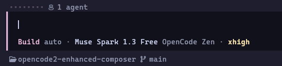
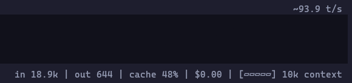

# Enhanced Composer

Enhanced Composer is an OpenCode 2 TUI plugin that replaces the prompt footer and draws configurable status widgets above and below the composer.

> **A Nerd Font is required to display all default glyphs correctly.** If you prefer not to use a nerd font, use **Customize footer** (`/customize-footer`) to replace those icons with text or hide them.

<p align="center">
  
    &nbsp;
  
</p>

Every widget can be moved between the four corners of the composer, reordered, and hidden. Most widgets also have appearance controls; TPS always uses a `~N t/s` rate label.

Configure it from the in-TUI **Customize footer** editor (`/customize-footer`) or by editing `cli.json`. [Configuration](docs/CONFIGURATION.md) lists every setting, what it changes, and the editor keys.

## Install

The minimum supported OpenCode 2 version is `2.0.11`. Install it with the CLI's plugin command, which adds the entry to `cli.json` for you:

```sh
opencode plugin add opencode2-enhanced-composer
```

Or add the package to `cli.json` yourself:

```json
{
  "plugins": ["opencode2-enhanced-composer"]
}
```

OpenCode 2 installs the package into its own cache and reuses the newest cached generation, so a restart alone may not pick up a new release. Delete the package's cache directory and restart to upgrade:

```sh
rm -rf ~/.cache/opencode/npm/opencode2-enhanced-composer@latest
```

## Run from source

From the repository root, install the development dependencies before opening OpenCode 2:

```sh
npm ci
```

Point a path entry in `cli.json` at this repository's directory:

```json
{
  "plugins": [
    {
      "package": "/absolute/path/to/opencode2-enhanced-composer"
    }
  ]
}
```

The entry must be a directory containing a `tui.tsx` entry file. OpenCode 2 skips entries that point at a file, so aiming at `src/footer.tsx` or `dist/tui.js` directly loads nothing. [Development](docs/DEVELOPMENT.md) covers the commands and the build.

## Documentation

| Document | Contents |
| :- | :- |
| [Configuration](docs/CONFIGURATION.md) | Every option, the settings editor, and what each widget shows. |
| [Development](docs/DEVELOPMENT.md) | Commands, tests, build, and CI. |
| [Architecture](docs/ARCHITECTURE.md) | Module map, data flow, and design invariants. |
| [Release](docs/RELEASE.md) | Maintainer runbook. |
| [options.schema.json](options.schema.json) | Machine-readable options schema. |
